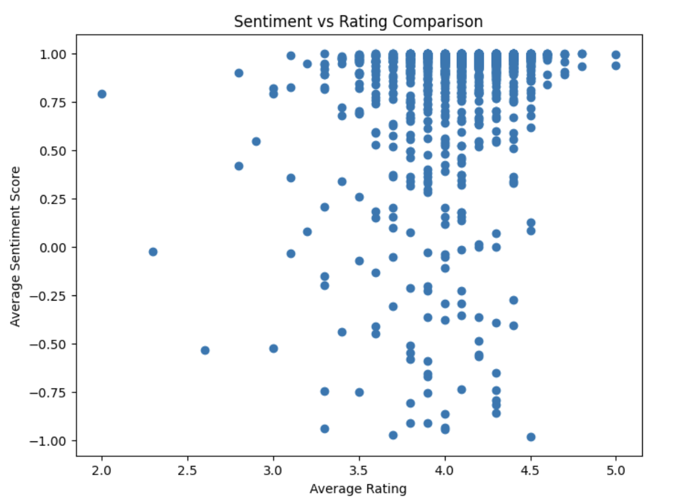
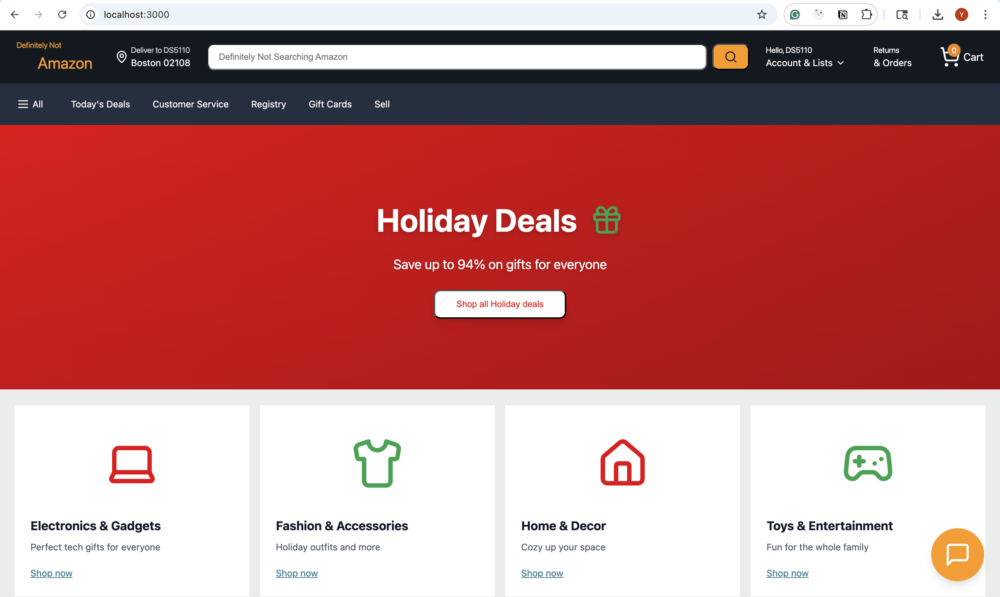
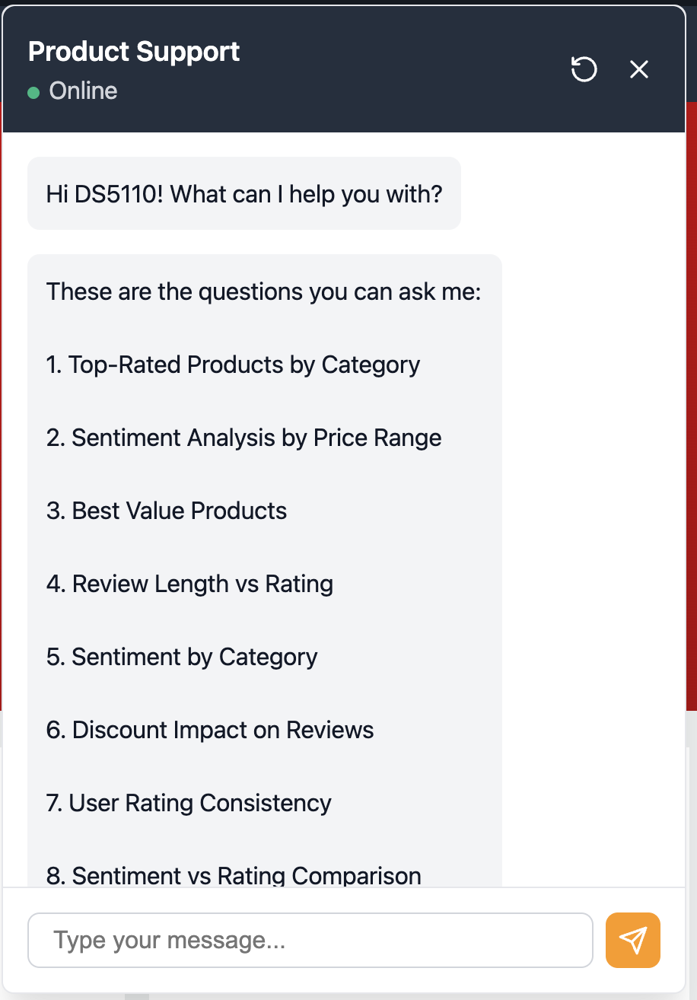
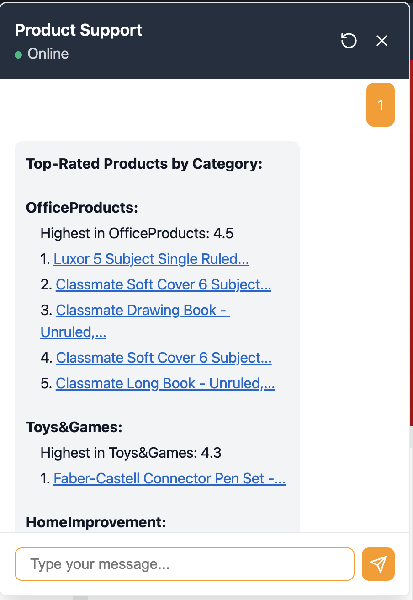

# Product Review Chatbot

A web app for analyzing Amazon product reviews. You can search products, read reviews, and chat with a bot that answers questions about product analytics. Built with Flask and React.

## Features

- Search and browse products
- Read product reviews with ratings and sentiment scores
- Chat with a bot that can answer 8 different types of analytical questions:
  1. Top-rated products by category
  2. Sentiment analysis by price range
  3. Best value products (rating/price ratio)
  4. How review length relates to ratings
  5. Sentiment trends by category
  6. How discounts affect review quality
  7. Rating consistency across products
  8. Comparing sentiment scores vs ratings

## Tech Stack

**Backend**: Flask (Python), MySQL  
**Frontend**: React + TypeScript, Vite, Tailwind CSS

## Approach/Methodology

1. **Data Processing**: Load Amazon reviews from CSV into MySQL database. Use VADER model to calculate sentiment scores for each review.

2. **Backend**: Flask API with 8 endpoints. Each endpoint runs SQL queries to answer different analytical questions (e.g., top products, best value, sentiment analysis).

3. **Frontend**: React chatbot that:
   - Calls the right API endpoint
   - Shows results in formatted tables

4. **Database**: [View ERD](docs/ERD.pdf) - Three tables (products, users, reviews) with relationships between them.

## Prerequisites

- Python 3.x
- Node.js and npm
- MySQL (5.7+ should work fine)

## Getting started

### Database setup

Make sure MySQL is running, then import the schema:

```bash
mysql -u root -p < final_project_mysql_schema.sql
```

This creates the `final_project_db` database with tables for products, users, and reviews.

**Custom database config?** Create a `.env` file in `backend/db/`:

```env
DB_HOST=localhost
DB_PORT=3306
DB_USER=root
DB_PASSWORD=<your_password>
DB_NAME=final_project_db
```
### Install dependencies

**Backend (Python):**
```bash
cd backend
pip install -r requirements.txt
```

This installs:
- Flask (web framework)
- flask-cors (CORS support)
- mysql-connector-python (MySQL database connector)
- python-dotenv (environment variable management)

**Verify installation:** You should see all packages installed successfully. If you get errors, make sure you're using Python 3.x and pip is up to date:
```bash
python --version  # Should be 3.x
pip --version
```

**Frontend (Node.js/npm):**
```bash
cd frontend
npm install
```

This installs all React dependencies, Vite, and other frontend packages listed in `package.json`.

**Verify installation:** You should see `node_modules/` folder created in the `frontend/` directory. If you get errors:
- Make sure Node.js and npm are installed: `node --version` and `npm --version`
- Try deleting `node_modules/` and `package-lock.json`, then run `npm install` again

## Running the Application

You'll need two terminal windows - one for backend, one for frontend.

**Terminal 1 - Backend:**
```bash
cd backend
python run.py
```

Should see something like:
```
Starting Flask server on http://localhost:5001
```

**Terminal 2 - Frontend:**
```bash
cd frontend
npm run dev
```

Once both are running, you're good to go! The app will be at http://localhost:3000.

### ⚠️ Important: Port Configuration & CORS

**The backend MUST run on port 5001** (not 5000). The CORS configuration is set up to allow requests from:
- `http://localhost:3000` (default Vite dev server)
- `http://localhost:5173` (alternative Vite port)

**If you change ports, you MUST update the CORS configuration:**

1. **Backend port**: Edit `backend/api/__init__.py` line 6 to add your frontend URL:
   ```python
   CORS(app, origins=["http://localhost:3000", "http://localhost:5173", "http://localhost:YOUR_PORT"])
   ```

2. **Frontend API URL**: Edit `frontend/src/services/api.ts` line 1 if you change the backend port:
   ```typescript
   const API_BASE_URL = 'http://localhost:YOUR_BACKEND_PORT/api';
   ```

**Common CORS Error**: If you see "CORS policy" errors in the browser console, make sure:
- Backend is running on port **5001** (check the terminal output)
- Frontend is running on port **3000** or **5173** (or update CORS config)
- Both servers are running before you try to use the app

## API endpoints

The backend runs on port 5001. Here's what's available:

**Products:**
- `GET /api/health` - Check if backend is alive
- `GET /api/products/search?q=<query>` - Search products
- `GET /api/products/<product_id>` - Get a specific product
- `GET /api/products/<product_id>/reviews?limit=5&offset=0` - Get reviews for a product

**Analytics (used by the chatbot):**
- `/api/analytics/top-rated-by-category`
- `/api/analytics/sentiment-by-price-range`
- `/api/analytics/best-value-products`
- `/api/analytics/review-length-rating`
- `/api/analytics/sentiment-by-category`
- `/api/analytics/discount-review-quality`
- `/api/analytics/rating-variance`
- `/api/analytics/sentiment-rating-comparison`

## Results, Outputs, or Demos

The chatbot can answer 8 types of questions:
1. Top-rated products by category
2. Sentiment analysis by price range
3. Best value products
4. Review length vs rating
5. Sentiment by category
6. Discount impact on reviews
7. Rating consistency
8. Sentiment vs rating comparison

**Outputs**: MySQL database, 8 API endpoints, React chatbot interface.

### Example Analysis: Sentiment vs Rating Comparison



**Results:**
- Weak positive correlation between sentiment score and rating
- High sentiment scores concentrated in 0.75-1.0 range
- Some outliers: products with high ratings (4.3+) but low/negative sentiment scores

**Insights:**
- Ratings don't always express true customer feelings. Sentiment captures more emotional details.
- "Underrated" products: positive sentiment but low ratings (e.g., good experience but lowered rating due to price/delivery)
- "Overrated" products: high ratings but not positive enough reviews

## Our website demos




---

This is a course project (DS5110). If you run into issues or have questions, feel free to reach out.
